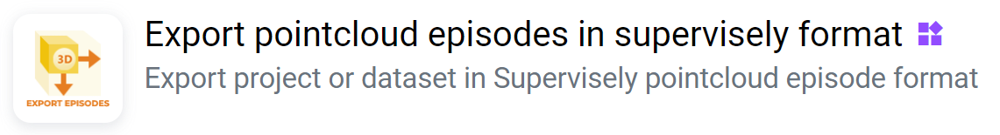
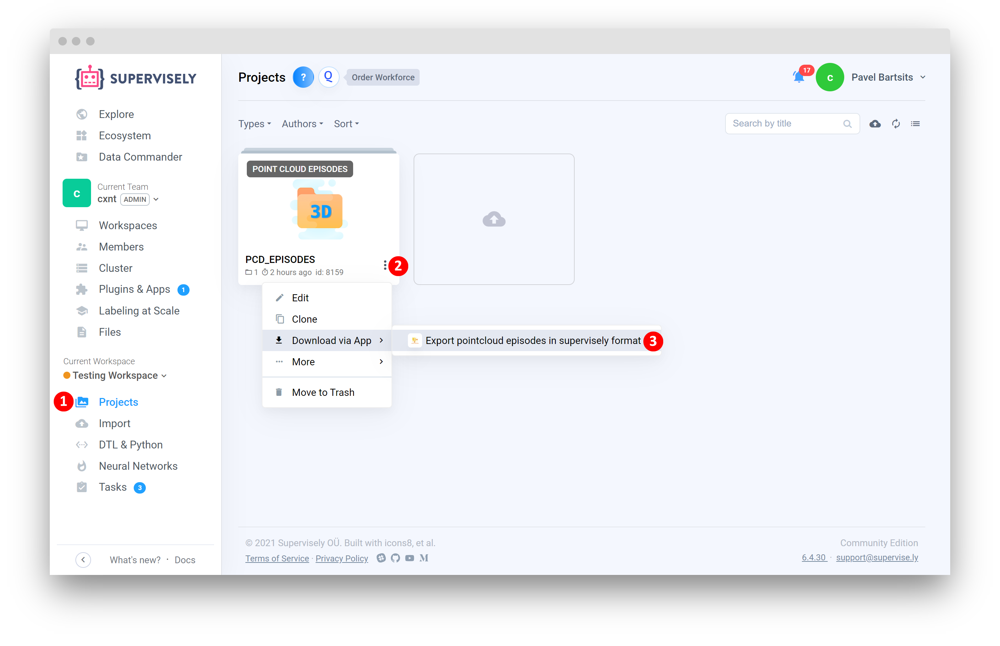
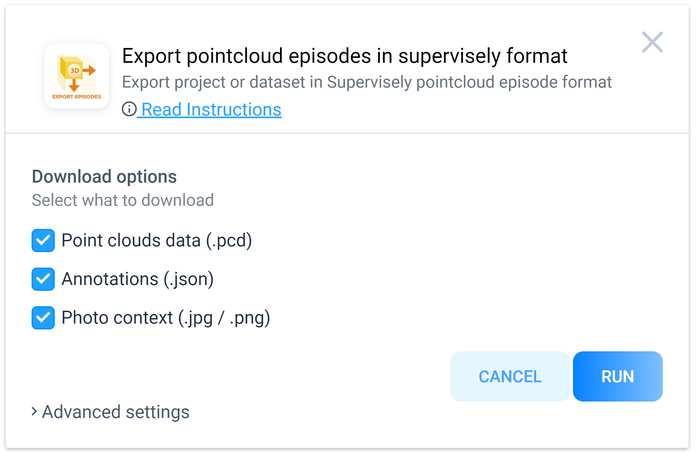
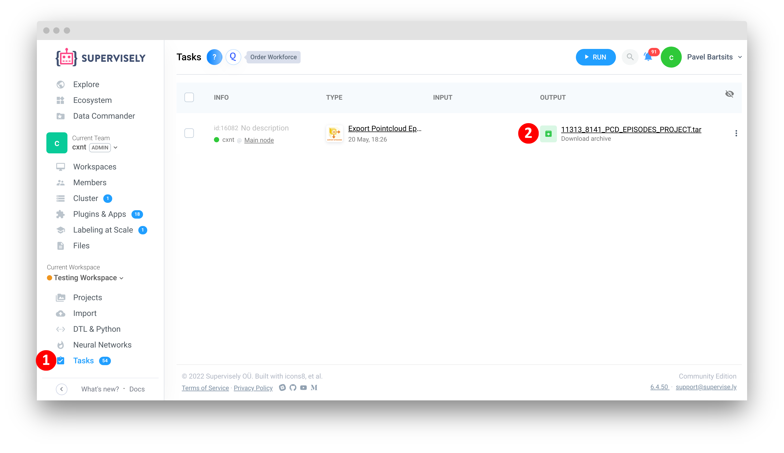
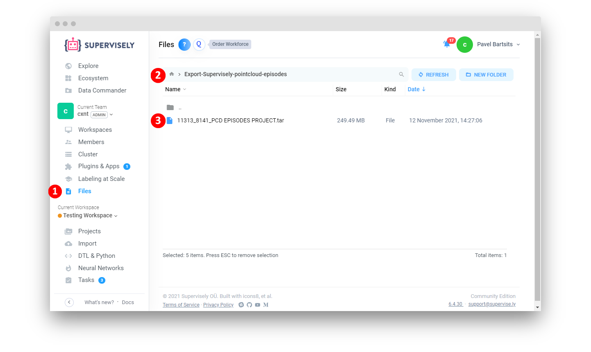

# Export Supervisely Pointcloud Episodes

  <a href="#Overview">Overview</a> •
  <a href="#How-To-Run">How To Run</a> •
  <a href="#How-To-Use">How To Use</a>

## Overview

Export Supervisely pointcloud episodes project or dataset. You can learn more about format and its structure by reading [documentation](https://docs.supervise.ly/data-organization/00_ann_format_navi/07_supervisely_format_pointcloud_episode).

Backward compatible with [`Import pointcloud episodes`](https://ecosystem.supervise.ly/apps/import-pointcloud-episode) app

# How To Run 

1. Add [Export Supervisely pointcloud episodes](https://ecosystem.supervise.ly/apps/export-pointcloud-episode) to your team from Ecosystem

  

2. Run app from the context menu of **Pointcloud Episodes Project** or **Images Dataset** -> `Download via app` -> `Export pointcloud episodes in supervisely format`

3. Define export settings in modal window and press the **Run** button

# How To Use 

1. Wait for the app to process your data, once done, a link for download will become available

2. Result archive will be available for download by link at `Tasks` page or from `Team Files` by the following path:

`Team Files`->`Export-Supervisely-pointcloud-episodes`->`<task_id>_<projectId>_<projectName>.tar`

